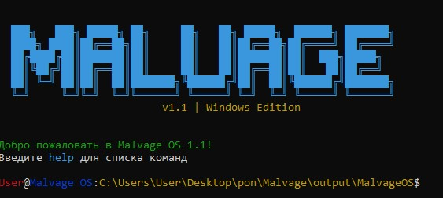

# Руководство пользователя MalvageOS

## Оглавление
1. [Введение](#введение)  
2. [Системные требования](#системные-требования)  
3. [Установка](#установка)  
4. [Основные команды](#основные-команды)  
5. [Встроенные приложения](#встроенные-приложения)  
6. [Примеры использования](#примеры-использования)  
7. [Частые проблемы](#частые-проблемы)  

---

## Введение
MalvageOS — это концептуальная операционная система, написанная на Python. Она предоставляет:  
- Базовые файловые операции  
- Системные утилиты (ping, запуск команд)  
- Приложения: калькулятор, текстовый редактор, игру "Змейка"  
- Кроссплатформенную работу (Windows/Linux/macOS)  



---

## Системные требования
- Python 3.6+  
- Библиотека `colorama`  
- Терминал с поддержкой ANSI-цветов  

---

## Установка
1. Скачайте файлы системы:
```bash
git clone https://github.com/yourusername/malvageos.git
cd malvageos
```

2. Установите зависимости:
```bash
pip install colorama
```

3. Запустите систему:
```bash
python malvage_os.py
```

---

## Основные команды

### Файловая система
| Команда | Описание | Пример |
|---------|----------|--------|
| `ls`    | Список файлов | `ls Documents` |
| `cd`    | Сменить директорию | `cd /home/user` |
| `mkdir` | Создать директорию | `mkdir new_folder` |
| `rm`    | Удалить файл | `rm old_file.txt` |

### Системные утилиты
```bash
# Выполнить команду ОС
run ipconfig  # Windows
run ifconfig  # Linux/macOS

# Проверить соединение
ping google.com

# Очистить экран
clear
```

---

## Встроенные приложения

### 1. Калькулятор (`calc`)
**Запуск:**  
```bash
calc
```

**Возможности:**  
- Арифметические операции: `5 + 3*2`  
- Тригонометрия: `sin(pi/2)`  
- Логарифмы: `log(100)`  
- История команд: `hist`  


### 2. Текстовый редактор (`edit`)
**Запуск:**  
```bash
edit
```

**Команды редактора:**  
```bash
open example.txt  # Открыть файл
edit              # Редактировать
save              # Сохранить
```

### 3. Игра "Змейка" (`snake`)
**Управление:**  
- WASD/Стрелки — движение  
- Q — выход  


---

## Примеры использования

### Создание проекта
```bash
# 1. Создать папку
mkdir my_project
cd my_project

# 2. Создать файл
edit hello.txt
> Ввести текст
> Сохранить (команда save)

# 3. Просмотреть файл
cat hello.txt
```

### Работа с сетью
```bash
# Проверить доступность сервера
ping 8.8.8.8

# Получить IP-конфигурацию
run ipconfig  # Windows
```

---

## Частые проблемы

### 1. Ошибки кодировки на Windows
**Решение:**  
Добавить при запуске:
```bash
python -X utf8 malvage_os.py
```

### 2. Не работает управление в "Змейке"
**Проверьте:**  
- Наличие прав доступа к терминалу  
- Не используется ли WSL для Linux-приложений  

---

## Лицензия
Проект распространяется под лицензией [MIT](https://opensource.org/licenses/MIT).

---

*Последнее обновление: 19 апреля 2025 год*  
*Автор: Геннадий*  
*Контакты: genkaprostotak@gmail.com*  

---
